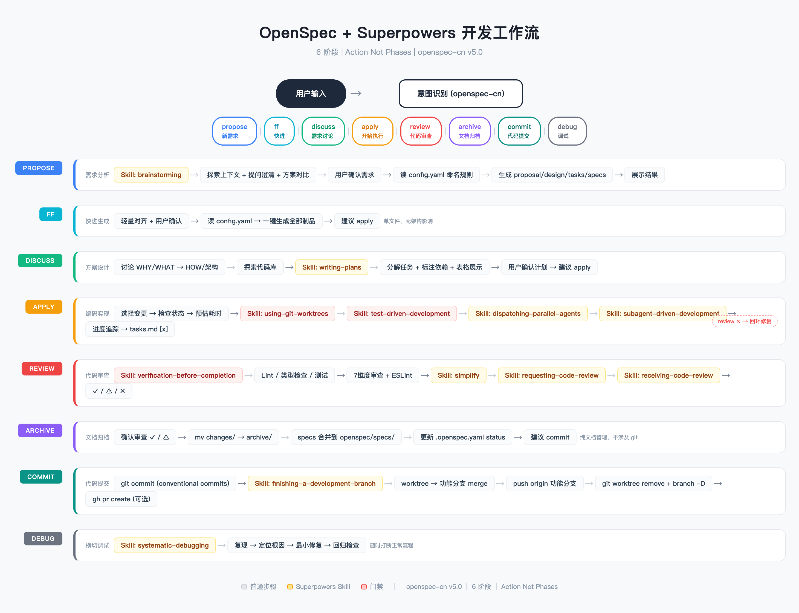

## Claude 个人用工作流：从一堆规则到一个技能集合

 

在使用 Claude Code 的几个月里，我的配置从几个零散的 rules 文件逐渐膨胀成一个庞大的 `openspec-cn` skill（548 行），维护起来越来越痛苦。上周末做了一次系统性重构：将单体 skill 拆成技能集合 + rules 分层，顺便把工作流从 OpenSpec 生态升级到 Superpowers 生态。

这篇文章记录重构后的架构设计和背后的取舍。

---

### 1. 问题：单体 skill 的 548 行诅咒

重构前的 `openspec-cn` SKILL.md 包含了所有东西：

- 流程状态机（6 个阶段 + 快进模式 + 失败回环）
- 每个阶段的完整执行步骤（propose / discuss / apply / review / archive / commit）
- 意图识别路由表
- 中断恢复逻辑

一个文件 548 行，每次改一个环节都要在整面墙里找位置。更麻烦的是：**系统提示里它就是一个 skill**，无法按阶段独立触发。比如只想"代码审查"，入口会把所有 6 个阶段的逻辑都加载进上下文，浪费 token。

> 原则：**一个 skill 只做一件事。** 违反了这个原则，维护成本和上下文浪费就是代价。

---

### 2. 整体架构：入口 + 6 个子 skill + rules 分层

重构后的结构：

```
~/.claude/
├── CLAUDE.md                         # 精简入口：工作流引用 + 分层规则（13 行）
├── rules/
│   ├── behavior.md                   # 行为准则（4 项）
│   └── iron-laws.md                  # 补充铁律（3 条）
└── skills/
    ├── shadow-openspec-superpowers-workflow/          # 工作流入口（路由 + 状态机）
    ├── shadow-openspec-superpowers-workflow-propose/  # 需求创建（full + ff 双模式）
    ├── shadow-openspec-superpowers-workflow-discuss/  # 需求讨论
    ├── shadow-openspec-superpowers-workflow-apply/    # 执行（预估 + TDD + 并行Agent）
    ├── shadow-openspec-superpowers-workflow-review/   # 审查（7 维度 + 分级回环）
    ├── shadow-openspec-superpowers-workflow-archive/  # 文档归档
    └── shadow-openspec-superpowers-workflow-commit/   # 代码提交 + openspec 文档
```

**分层逻辑**：

| 层级 | 放什么 | 例子 |
|------|--------|------|
| CLAUDE.md | 入口引用 + 分层声明 | 工作流统一入口为 `xxx-workflow` |
| rules/ | 全上下文行为规则 | 行为准则、铁律 |
| skills/ | 可调用的工作流模块 | propose、review、commit |

> 关键决策：**子 skill 用平级目录而非嵌套**。Claude Code 只发现 `~/.claude/skills/` 下的顶级目录，嵌套子目录中的 SKILL.md 不会被系统提示收录，Skill 工具也无法直接调用。

---

### 3. 流程状态机



上图是整个工作流的完整状态机，核心设计原则是 **Action Not Phases**——每个 Action 是独立能力，不强制按顺序完成：

```
                ┌── ff（快进: propose + 制品一键生成）──┐
                │                                         │
                ↓                                         ↓
propose ──→ discuss ──→ apply ──→ review ──→ archive ──→ commit
 新建需求     需求讨论     开始执行    代码审查   文档归档   提交/PR
                           ↑            │
                           │   ✓ 通过   │
                           │            │
                           └── ✗ 阻塞 ──┘  (失败回环: 修复后重新审查)
```

不同场景走不同路径：

- **紧急 hotfix** → 跳过 brainstorming，直接 propose + apply
- **小修复** → `ff` 快进，跳过 discuss 一键生成制品
- **需求模糊** → 必须走完整 brainstorming，不跳过探索
- **复杂功能** → 完整 6 步流程

**回环机制**：review 发现阻塞项 → 回到 apply 修复 → 重新 review → 直到通过或用户决定停止。

---

### 4. 各阶段详解

#### 4.1 Propose（需求创建）—— full + ff 双模式

propose 子 skill 合并了两个入口：

| 模式 | 触发词 | 流程 |
|------|--------|------|
| **full** | "新需求"、"propose" | brainstorming → 完整制品（.openspec.yaml + proposal + design + tasks + specs） |
| **ff** | "快进"、"ff" | 轻量对齐 → 一键生成全部制品 |

双模式的判断逻辑在 propose 内部完成：开场检查上下文，入口传了 "快进" 就走 ff，没传就走 full；直接调用 propose 时开场询问「完整还是快进？」。

> 合并的理由：ff 本质就是轻量 propose，拆成两个 skill 反而增加维护负担。

#### 4.2 Discuss（需求讨论）—— 只讨论不实现

思考模式，可读代码、搜索、调研，但不写代码。根据用户方向自动调节深度：

- 偏需求 → 聊 WHY/WHAT、用户场景、边界
- 偏架构 → 聊 HOW、模块拆分、技术选型、API 设计

讨论结束调用 `superpowers:writing-plans` 生成实施计划表：

```
| # | 任务 | 模式 | 依赖 | 涉及文件 |
|---|------|------|------|----------|
| 1 | 创建 common 接口 | 前台 | 无   | common.ts |
| 2 | 异常过滤器       | 前台 | 无   | filter.ts |
```

#### 4.3 Apply（执行）—— 预估 + 隔离 + 并行

执行阶段是整个工作流最复杂的部分，核心流程：

1. **选择变更** → 检查 openspec 状态
2. **预估耗时 + 依赖分析** → 画 DAG，同层无依赖 task 归入同一 Phase
3. **执行前决策**：
   - 涉及 2+ 文件修改 → 调用 `superpowers:using-git-worktrees` 创建隔离 worktree
   - 新功能/复杂重构/Bug 修复 → 调用 `superpowers:test-driven-development` 走 TDD
4. **按 Phase 并行执行** — 同 Phase 无依赖 task 并行 Agent，有依赖串行
5. **进度追踪** → 完成后标记 tasks.md checkbox

执行完成输出对比表：

```
| Task | 预估 | 实际 | 状态 |
|------|------|------|------|
| 创建 common 接口 | 5min | 4min | ✓    |
| 异常过滤器       | 5min | 7min | ✓    |

总预估: 34min | 总实际: 32min | 并行节省: ~10min
```

#### 4.4 Review（审查）—— 7 维度 + 分级回环

apply 完成后的质量门禁。先跑 `superpowers:verification-before-completion`（Lint + 类型检查 + 测试），全绿才进入正式审查。

审查 7 个维度：

| # | 维度 | 检查内容 |
|---|------|----------|
| 1 | 任务完成度 | tasks.md 所有 checkbox `[x]` |
| 2 | 需求覆盖 | 按 spec 的 GIVEN/WHEN/THEN 逐条对照 |
| 3 | 设计一致性 | 实现是否匹配 design.md |
| 4 | ESLint | error 阻塞 / warning 由用户决定 |
| 5 | 代码质量 | 重复代码、过长函数（>50行）、过深嵌套（>3层） |
| 6 | 安全性 | 注入风险、敏感信息泄露、权限控制 |
| 7 | 性能 + 变更范围 | N+1 查询、超出 proposal 范围的改动 |

审查结果三级分级：

| 结果 | 含义 | 动作 |
|------|------|------|
| ✓ 通过 | 无阻塞项 | → archive |
| ⚠ 建议 | 有建议无阻塞 | 用户决定 |
| ✗ 阻塞 | 有必须修复的问题 | → 回到 apply → 重新 review |

#### 4.5 Archive（归档）—— 纯文档管理

将 `openspec/changes/<name>/` 移到 `archive/`，同步 specs 增量到 `openspec/specs/<domain>/`。**不涉及 git 操作**。

#### 4.6 Commit（提交）—— 代码 + openspec 文档一起交

修复前只提交代码、遗漏 openspec 文档的问题。现在两步提交：

```bash
# 1. 主仓库提交 openspec 文档
git add openspec/changes/archive/<name>/ openspec/specs/
git commit -m "docs(openspec): 归档需求文档 <name>"

# 2. worktree 提交代码
git add <changed-files>
git commit -m "type(scope): description"

# 3. 合入功能分支 → 推送 → 清理 worktree
```

---

### 5. Rules 分层：行为准则从项目级提升到系统级

原本行为准则只写在项目 CLAUDE.md 里，换个项目就丢了。重构后放到 `~/.claude/rules/` 下，所有项目共享：

```
~/.claude/rules/
├── behavior.md      # 行为准则：先想清楚再写代码 / 简单优先 / 外科手术式修改 / 目标驱动执行
└── iron-laws.md     # 补充铁律：TDD 门禁 / 验证门禁 / 调试纪律
```

**CLAUDE.md 从 50 行压缩到 13 行**，只保留入口引用和分层声明。

> 原则：**CLAUDE.md 只管路由，规则归 rules/，技能归 skills/。** 各司其职，改了规则不用动 CLAUDE.md，换了工作流不用改规则。

---

### 6. 几个设计决策

**为什么子 skill 叫 `shadow-openspec-superpowers-workflow-propose` 这么长的名字？**

命名确实长，但包含了三个关键信息：作者（shadow）、协议（openspec + superpowers）、用途（workflow）。在几十个 skill 里能一眼分辨归属，长但不会撞名。

**为什么 ff 不拆成独立 skill？**

ff 是 propose 的轻量变体，只差在跳过 brainstorming。拆成两个 skill 意味着改 propose 逻辑时要同步改两份。合并后只需维护一个文件，模式判断在文件内部完成。

**入口只做路由，不包含执行细节**

入口 SKILL.md 从 548 行压缩到 80 行，只保留：流程状态机、意图识别路由表、中断恢复逻辑。每个阶段的执行步骤全在子 skill 里，入口只是"总机接线员"。

---

### 7. 怎么用

日常使用只需对 Claude Code 说一句话：

```
"新需求：博客添加暗色模式"              → 自动进 propose
"这个需求技术方案讨论一下"              → 自动进 discuss
"开始执行"                              → 自动进 apply
"代码审查"                              → 自动进 review
"归档" / "提交"                         → 自动进 archive / commit
```

老司机也可以直接跳到指定阶段：`Skill("shadow-openspec-superpowers-workflow-review")`。

---

### 8. 总结

这次重构核心做了三件事：

1. **拆单体 skill 为技能集合** — 入口路由 + 6 个独立子 skill，按阶段按需加载
2. **建 rules 分层** — 行为准则系统级共享，CLAUDE.md 精简为入口
3. **修复设计漏洞** — commit 阶段补充 openspec 文档提交，ff 合并到 propose 减少维护面

> 如果一个 skill 文件超过 200 行，就该问自己：它是不是在干多件事？
