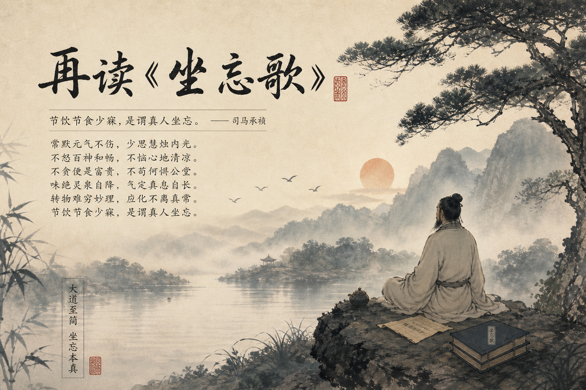

## 再读《坐忘歌》

> 常默元气不伤，少思慧烛内光。
>
> 不怒百神和畅，不恼心地清凉。
>
> 不求无谄无曲，不执可圆可方。
>
> 不贪便是富贵，不苟何惧公堂。
>
> 味绝灵泉自降，气定真息自长。
>
> 触则形毙神游，想则梦索尸僵。
>
> 气漏形归后土，念漏神归死乡。
>
> 心死方得神活，魄灭然后魂昌。
>
> 转物难穷妙理，应化不离真常。 
>
> 至精潜于恍惚，大象混于渺茫。
>
> 造化若知规矩，鬼神莫测行藏。
>
> 节饮节食少寐，是谓真人坐忘。
>
> -- 司马承祯

我们公司的一个同事，见面就给我吐槽压力很大，中年危机。我也不善言辞，不知道要怎么安慰他才好，只能跟他插诨打科，消解一下他的苦闷。

今天本来是给自己安排的游戏日，本想称着台风天在家里打一天游戏。不知道是不是他影响了我一下，早上 7 点醒过来，随口念了两句**不怒百神和畅，不恼心地清凉**。

可能是太长时间没有压力了，前后几句全给忘记了，所以只好临时改变了一下计划，今天还是读书日吧。

这首歌是一首道教的养气歌，司马承祯是唐代玄宗时期的著名道士，活了 90 多岁，非常难得。

同时，他还是李白的恩主，李白少年出川时遇到了他，后期的书法作品《上阳台帖》就是这两人的羁绊。

### 六戒

我还记得之前有一个玩笑，问: 如何让自己长命百岁，回答就是保持呼吸，不要断气。这个纯是瞎扯淡的，只能活跃气氛不能帮助他人。

我们来看一下大佬是如何劝人的，首先明确一点人家在几千年前活了 90 多岁，多少还是有点帮助的。

#### **常默元气不伤，少思慧烛内光**

这一段就是在劝我们不要胡说八道，胡思乱想，紊乱自己的磁场。后面人家就详细展开说了六种场景，给了我们一些参考。这首歌里面没有生僻字，跟白居易的风格一样，所见即所得，几乎没有理解难度。

人生一世不过 3 万多天，实在是太短了。

欲望，是最恐怖的东西。孔夫子说要克己复礼，何也？他所推崇的周礼在春秋末已经彻底破产，没有半点市场了，尊王攘夷成了笑话了。他忽略了人的贪心，他认为可以使用礼法的教育达到克己的目的，但是环境已经不允许了。

春秋以来的义战已经转化为孙子兵法中的兵不厌诈了。为了胜利可以不择手段，我们都在笑宋襄公的半渡不击，却没想到他也只是一个不死的老兵，新时代的船上已经没有他的位置了。

环境在方方面面影响着我们，但是我们先思考一下，我们真正的需求有哪些？

日不过三餐，夜不过一宿，四季的衣服 8 套已经足够了，出行除了在老家乡下，到处走都方便。我也不知道是不是我的需求太低，太容易满足，比起物质上的富足我更倾向于精神上的进步。

没了那么些乱七八糟的想法，我发现我的生活及其轻松。上班就好好上班，把自己的本质工作做好已经是非常好的了，很多人都做不好自己的工作。下班了就好好生活，给自己找一点乐子，玩游戏、写代码、找朋友聊天，玩累了就看看书、写写字。

此乐何极~

### 六真

中间 4 句不用看，直接看后四句。里面非常唯物的提出了六个修真的方法，但是我只需要最后一个。

#### 节饮节食少寐，是谓真人坐忘

年龄越来越大了，代谢能力也在慢慢减弱，现在得控制一下自己的体重，30 来岁的人是不可以太胖的，那样形象非常不好，尤其是不能有小肚子。

节饮节食的意思并不是说让你少吃少喝，而是节制自己，饭吃八分饱，保留一点点饥饿感最好。

少寐的意思不是让你少睡觉，人家睡觉的时间是 6 个时辰 12 个小时，我现在的睡眠质量特别的差，也不知道为什么，1 点睡去 7 点醒来。有的时候睡到 8 点，那简直是烧高香了，所以每天都是晕晕乎乎，身体素质贼差，很容易感冒。

