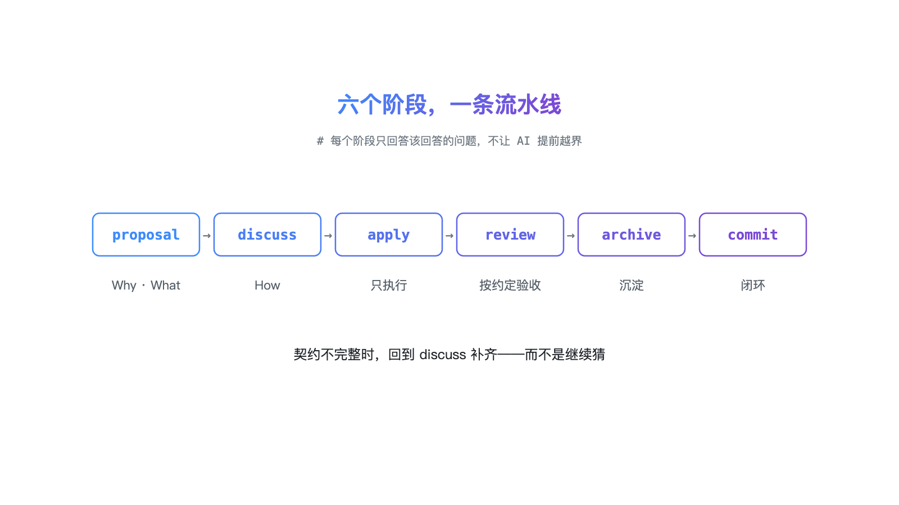
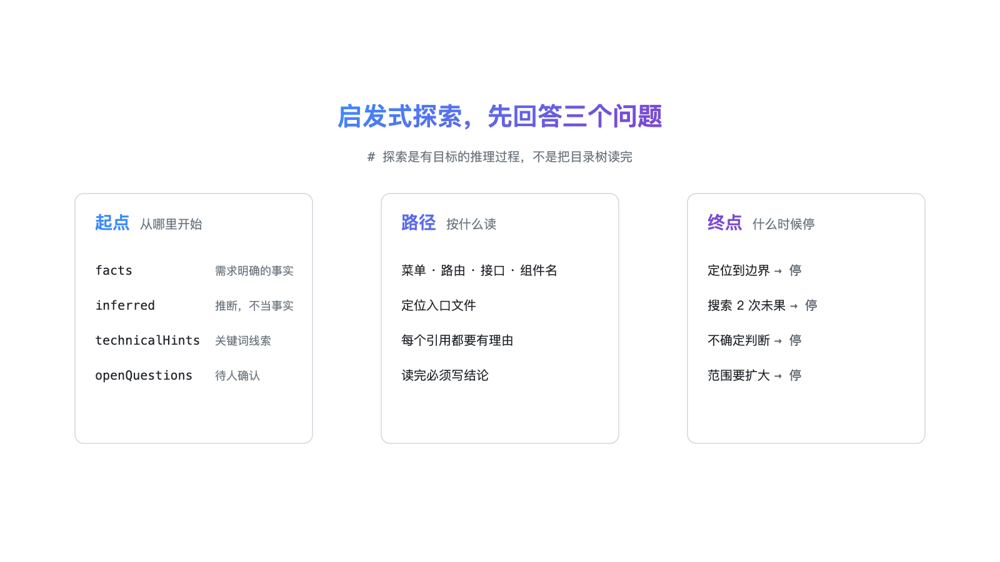
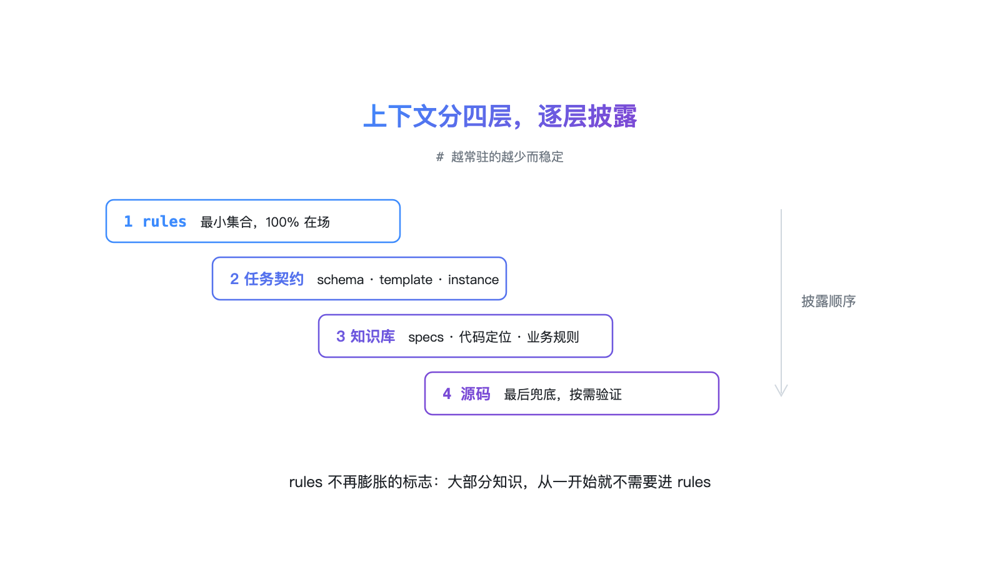
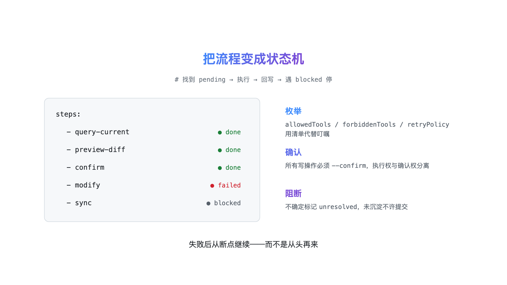
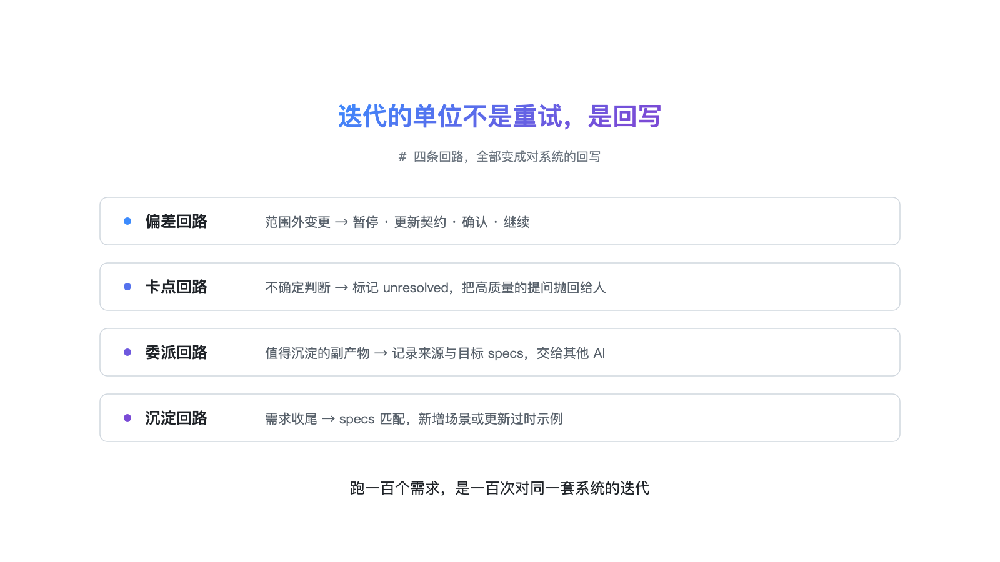
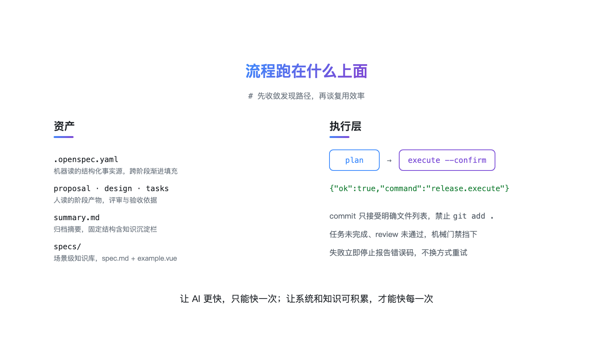

## Vibe Coding Workflow 概述

在今年 4 月底我开始正式接触和使用 AI，最开始使用的 chatgpt 和 opus，使用的方式也很简单一问一答，跟 AI 一轮一轮地对话，让 AI 执行，然后人工介入验收代码和代码。

慢慢地我们开始发现，有点不太对劲。在团队开发的过程中，每一个人可能会遇到相同的需求，但是每一个的提示词不同，使用的大模型不同，使用的智能体不同，得出的结果差异性特别的大，所以迫切地需要一个统一的流程性的内容，来限制或者是引导 AI 的探索与开发。

让 AI 不要无限制的、无边界的、无目的性的，非常随意的开发模式，这一套内容就是Vibe Coding 的 workflow 工作流。

接下来，我会给大家详细介绍，我给我们的团队准备的 workflow，以及其中遇到的问题和解决思路，希望可以解决大家的一些问题。

首先解决第一个问题，为什么我们需要工作流?

### 工作流存在的意义?



不要让AI更快写代码，应该是让 AI 先明确边界。如果我们是做的团队使用的工作流，那么还需要赋予更多的限制条件，需要明确的是以下两点:

1. 它是不是在正确的阶段做正确的事
2. 它失败之后会不会继续乱做

如果这两个问题不解决，AI 越快，返工也越快。所以工作流存在的意义不是当加速器，而是给 AI 装上**边界**和**刹车**。

#### 边界：把协作流程拆成阶段

我把整个 AI 协作流程拆成了 6 个阶段：

```text
proposal → discuss → apply → review → archive → commit
```

拆阶段不是为了显得流程完整，而是给 AI 一个明确边界。每个阶段只回答该回答的问题，不让 AI 提前越界:

- **proposal 只回答 Why 和 What**：需求为什么存在、用户真正想要什么、影响什么范围。最怕它在这个阶段过早进入实现思维，明明还在讨论业务目标，它已经开始说改哪个组件、字段放哪一列。一旦过早进入实现，AI 很容易把“推断”包装成“事实”。
- **discuss 才回答 How**：找入口、看引用链、找相似实现、定影响范围，确认哪些文件可以动、哪些不该动，最后沉淀成执行契约。很多 AI 失控不是发生在写代码的时候，而是 discuss 阶段边界没收住。
- **apply 只执行，不重新设计**：只做一件事，消费 discuss 交棒下来的执行契约。一旦允许它重新设计，几乎一定会扩大范围、偷偷改设计、顺手补它觉得也该改的东西。契约不完整，正确动作是回到 discuss 补齐，而不是继续猜。
- **review 验证的不是“能不能跑”，而是“有没有按约定做”**：需求是否满足、设计是否按约定实现、改动有没有超出宣称范围、上游交棒信息有没有被绕过。review 真正防的就是 apply 阶段偷偷扩大范围。
- **archive 和 commit 把一次执行变成下次的资产**：沉淀业务规则、代码定位路径、归档摘要，确认代码、文档、知识都到位，让下一次 AI 不用从零开始猜。

#### 刹车：治理低能力智能体的失败行为

阶段拆好之后，还要解决另一个问题。我后来越来越确定：

> 低能力智能体最危险的，不是不会做，而是失败之后还在继续做。

第一次失败之后，它不知道为什么失败、不会停、换个参数继续试、换个工具继续试，最后把上下文越搞越乱。这种行为看起来像“很努力”，本质上是在制造噪音，是工作流里最大的噪音源。

它的问题不在理解，而在控制。很多时候它不是“不知道规则”，而是不知道什么时候该停，把所有失败都理解成“再试一次”。所以不要指望它自己判断什么时候该停，必须替它定义清楚：

- **可以重试**：网络超时、临时连接失败、服务端 500
- **不能重试**：参数错误、权限错误、业务状态错误、调错工具、目标不存在
- **熔断规则**：同一工具 + 同一参数失败 2 次即停止；调错工具立即停止

再配合工具白名单、禁用工具清单、结构化步骤、状态回写、错误分类这些机制，比“多提醒几句就会变乖”有效得多。

### 启发式探索



大家一定也使用过类似于 **superpowers**/**openspec** 等等工作流，在使用这些工作流的时候，可能会遇到以下问题:

1. 无限制的读取源代码，如果当前文件处于文件树的最底层，它会读完所有的相关依赖的文件，会拉爆你的上下文
2. 拉爆上下文之后，智能体会自动进行**Compact**指令，压缩之后极有可能会导致 AI 幻觉
3. 查看 AI 的思考链路之后，发现它读取了很多无效的文件，有很多文件明明不相关，但是它还是会读

那么这些问题都体现了一个关键点，AI 可能会自由读取很多无意义文件。

有些需求，读两个文件就可以做出来，但是很不巧，源代码里面使用了一个超大的公共组件。这个时候 AI 会去读取这个超大的组件来了解它的用法，然后撑爆了你的上下文。

最后，做出来的效果，写出来的代码，不太尽如人意。你就会吐槽，垃圾大模型，垃圾智能体。

现在，我们来复盘一下，AI 频繁读取源代码/文件是一件合理的事情吗?

如果你的团队成员有 10 个人，每一个人都负责一块业务，他们肯定会有交叉的部分。当我们使用 AI 来探索需求的时候，对于交叉的部分需要每一个人都进行探索吗

大家一定使用过类似于codex/cc/trae/codebuddy 等等智能体或者是IDE，在使用的过程中一定也总结了很多 AI 经常犯的错误，将其升级沉淀到了 rules 文件中。

慢慢地，你发现 rules 文件太多了，内容太长了，已经开始占用AI 的 Context 了。过多的 rules 甚至已经开始影响 AI 的思考链路了，导致 AI 的推导结果相差甚远，token 使用量直线上升，推导时长过长的问题。

那就有意思了，添加 rules 文件是否合理? 或者是 哪些内容可以升级到 rules 文件里面去?

下面给大家介绍一下，我是怎么解决这些问题的，我们在做自己的工作流的时候一定要注意一个关键词**启发式探索**。

#### 工作流给 AI 指明方向

启发式探索的核心，不是放开手让 AI 去读，而是先回答三个问题：**从哪里开始、按什么路径读、什么时候停**。

**起点：从结构化线索出发，而不是从文件树出发。**

需求进来后，先由上游工具把需求内容解析成分层信息（我们用 zentao-fetch 解析禅道需求）：

- **facts**：需求原文明确要求的事实
- **inferred**：从截图、菜单、接口名推断出来的信息
- **technicalHints**：菜单关键词、接口关键词、可能涉及的应用
- **openQuestions**：还需要人确认的问题

discuss 阶段的代码探索就从这些线索出发：根据菜单、路由、接口、组件名、截图文本去定位入口文件，而不是从根目录开始盲扫。另外 facts 和 inferred 必须分开记录，AI 不允许把推断包装成事实。

**路径：每个阶段只做该阶段的事。**

| 行为 | proposal | discuss |
|---|---|---|
| 判断业务域、识别疑似应用 | 允许 | 允许 |
| 定位入口、追溯引用链、对比相似实现 | 不建议 | 职责所在 |
| 深读组件实现 | 不建议 | 有目的地读，挂到参考文件清单 |
| 生成文件级任务清单 | 不允许 | 输出 tasks.md |

proposal 阶段只允许轻量定位，输出口径也只能写“疑似涉及某仓库”，不能写“必须编辑某某 Vue 文件”。代码探索的主战场在 discuss，而且每个阶段消费的都是上游已经结构化好的结论，不用从头再猜一遍。

**终点：探索有明确的停止条件。**

- 已定位入口、引用链、改动边界 → 停止探索，进入设计
- 同一问题搜索超过 2 次仍未定位 → 停止，向用户确认
- 出现“可能 / 应该 / 通常”这类不确定判断 → 停止，标记为 unresolved
- 发现范围会扩大到新应用 → 停下来更新影响范围矩阵，向用户确认

这四条就是“启发式探索”和“自由探索”的分界线：探索是一个有目标的推理过程，目标达成了就停，而不是把目录树读完。

#### 给 AI 提供有效的上下文

方向指明之后，下一个问题是：不让它乱读源码，那 AI 靠什么理解代码库？答案是靠工作流准备好的四类有效上下文。

1. **结构化事实源 `.openspec.yaml`**：跨阶段唯一的交棒文件，记录需求事实、技术线索、影响范围矩阵、执行契约。每个阶段的 AI 消费的都是前序阶段已经结构化好的数据，不需要重新分析、重新猜。
2. **带理由的参考文件**：discuss 阶段读的每一个文件，都必须记录四件事——路径、角色、参考目的、读取原因。角色是个固定枚举：`entrypoint`（入口）、`pattern-reference`（模式参考）、`implementation-reference`（实现参考）、`dependency-reference`（依赖确认）、`negative-reference`（确认不采用的反例）、`risk-reference`（风险验证）。读完还要写结论。这份清单同时也是给用户看的：你可以直接打开这几个文件，快速确认 AI 为什么这样设计。
3. **组件使用场景沉淀**：这就是开头“超大公共组件”问题的解法。组件的真实使用场景沉淀在组件库仓库里，每个组件目录下有一组 specs，一个场景一个 spec.md + example.vue。example.vue 只保留关键代码——关键 props、events、slots、配置对象，删掉无关业务字段、敏感信息和一次性常量。AI 读几十行提炼过的示例，比读几千行组件源码拿到的上下文质量更高。
4. **归档知识**：每次需求结束，archive 阶段把业务规则、代码定位路径、可复用模式沉淀进 summary.md。第一个探索过的人把结论留下来，后面的人直接消费，不再重复探索。

回头看开头列的三个问题——上下文拉爆、Compact 后幻觉、读了一堆无效文件——本质都是同一件事：**喂给 AI 的上下文无效**。把上下文从“海量源码”换成“结构化事实 + 有理由的参考文件 + 提炼过的示例 + 前人沉淀”，问题就从根上解掉了。

#### 为什么不许 AI 读源代码

先澄清：这不是一刀切的禁令，而是三条具体的禁令。

**第一，不许漫无目的地读。**

AI 每读一个文件前，必须先回答“为什么读它”，回答不了就不要读。回到开头的例子：需求本身读两个文件就能做出来，但 AI 为了搞懂那个超大公共组件的用法，把几千行的组件源码读了一遍，上下文直接撑爆。而在我们的工作流里，它该读的是沉淀好的组件使用场景示例——几十行，直接告诉你这个场景怎么配。读源码是手段，不是目的；AI 探索真正要拿的是三个结论：**入口在哪、模式是什么、改动边界在哪**。

**第二，不许在错误的阶段读。**

proposal 阶段深读组件实现、追踪调用链都是被禁止的，只允许判断业务域、粗略识别疑似应用。因为在这个阶段读源码，AI 会把“推断”包装成“事实”，后面整个设计链路就全歪了。代码探索只属于 discuss，而且要受停止条件约束。

**第三，不许重复读别人已经读过的。**

团队 10 个人负责的业务一定有交叉。同一段公共逻辑，不应该每个人用 AI 探索时都重新读一遍。
第一个人读完后沉淀成代码定位路径和组件使用场景，后面九个人直接消费结论。读源码这个动作，在整个团队的生命周期里，一个模式只该发生一次，甚至零次。

说到底，“不许读源代码”背后是换了一个工作模式：把 AI 从“每次都从源码里重新猜结论”，切换成“消费沉淀的结论，按需回到源码验证”。至于沉淀下来的知识哪些进 rules、哪些按需加载，就是下一节渐进式披露要回答的问题。


### 渐进式披露



上一节结尾留了一个问题：沉淀下来的知识，哪些进 rules、哪些按需加载？

在回答之前，先想清楚一个反直觉的结论：rules 文件膨胀的根源，不是你写进去的内容错了，而是**所有知识都常驻在上下文里**。无论这次需求是改表格还是改权限，AI 都背着同一整套 rules 在跑。知识本身没有错，错的是披露的时机。

所以渐进式披露要解决的就是这件事：把“一次性全量塞给 AI”，改成“**分层、按需、在正确的时机披露**”。

#### 上下文分四层，越常驻的越少而稳定

我把给 AI 的信息分成四层：

1. **第一层：常驻规则（rules）**。只放每一类任务都绕不开的最小集合——阶段边界、每个阶段回答什么问题、输出口径。这一层 100% 占用上下文，所以必须少而稳定。
2. **第二层：任务契约（按类型加载）**。配置类、权限类这类步骤固定的任务，做成 YAML 执行契约，只有做这类任务时才加载对应契约。
3. **第三层：知识库（按需检索）**。组件使用场景、代码定位路径、业务规则，平时不进上下文，探索碰到相关域时才去检索。
4. **第四层：源代码（最后兜底）**。前三层都覆盖不了的时候，才回到源码验证。这也是上一节“不许读源代码”的完整含义：源码不是不能读，而是它排在披露顺序的最后。

YAML 契约的三层结构正好是这套思路的缩影：

- **schema** 定义字段和规则，几乎不变
- **template** 定义标准执行步骤，按任务类型复用
- **instance** 在具体需求里填真实参数，每次现场生成

AI 常驻的只有 schema 那一小段，模板按需取，实例现场填，新需求不用每次重新发明格式。

#### 知识库的检索顺序，就是披露的路径

第三层要真正可用，光有知识还不够，还得有**收敛的检索顺序**。组件网关帮 AI 建立的正是这个：

```text
先找类型 → 再找组件 → 再找场景 → 再找示例
```

每往下一层，进入上下文的信息都更精确：类型层只有几行，组件层多几行，到场景层才是具体案例。AI 的猜测空间随层级收敛。

要让这条路径稳定工作，有两个前提：

- **主归属规则**：跨组件场景只保留一份，放在主导组件下面。否则按需加载时会同时加载到两份互相冲突的知识，反而制造噪音。
- **知识必须是提炼过的**：spec.md 放模式，example.vue 只保留关键代码。按需加载进来的每一层，都应该是“几十行说清一件事”，而不是把业务包袱原文搬进来。

#### 阶段本身就是一次渐进式披露

回头看工作流的 6 个阶段，其实时间维度上也在做同一件事：

- proposal 只披露 Why 和 What
- discuss 才披露 How、参考文件、影响范围
- apply 只披露执行契约和任务清单

信息不是开局全给，而是随着阶段推进逐层披露。这也解释了 proposal 为什么不许读源码——源码是披露链的最底层，在错误的阶段读它，就是披露错位。

#### 所以，什么该进 rules

回到开头的问题，判断标准就一句话：

> **每一类任务都绕不开的，进 rules；只有一类任务用得到的，进契约；只有具体场景用得到的，进知识库。**

现在主流的智能体基本都支持 skill 这类机制：常驻上下文里只放一段简短的描述（什么时候触发、干什么用），正文按需加载。这正是渐进式披露的工程化落地。rules 文件不再膨胀的标志，不是你写得少了，而是大部分知识从一开始就不需要进 rules。


### 信号机制



前面两节解决了“方向”和“知识”的问题，但还剩一根支柱：**这些结构和策略，到底以什么形态传达给 AI？**

边界一节列过治理手段——白名单、状态回写、错误分类；刹车一节定义过策略——什么能重试、什么要熔断。但策略本身不会生效，它必须变成 AI 能直接消费的东西。我的答案是用**信号 Signal**：把控制信息从“自然语言里的叮嘱”，变成“结构里的字段”。

#### 状态：把流程变成状态机

先看配置类任务最典型的问题。一个简单的修改动作，正常顺序是：

1. 找到目标对象
2. 查旧值
3. 预览变更
4. 确认
5. 提交修改
6. 同步 / 记录结果

交给低能力智能体，就很容易变成：没查旧值直接改、没预览 diff 就提交、失败后直接重试。这类任务最重要的不是“会不会改”，而是**会不会按顺序改**。

所以我把它做成 YAML 状态机：

```yaml
steps:
  - query-current
  - preview-diff
  - confirm
  - modify
  - sync
```

每一步挂一个状态：

```yaml
status: pending | running | done | failed | blocked | skipped
```

有了状态，AI 的任务就不再是“理解一整段复杂流程”，而是：

- 找到当前 `pending` 的那一步
- 执行
- 回写状态
- 遇到 `blocked` 停止

上一步不是 `done`，下一步就不会开始——跳步骤在结构上就不可能发生。

#### 回写：让失败可以从断点恢复

状态写下来不是做样子的，关键在回写：

```yaml
- step: query-current
  status: done

- step: preview-diff
  status: done

- step: modify
  status: failed
```

低能力智能体还有一个很明显的问题：失败之后，它通常不知道应该从哪一步重新开始。没有状态，它就会从头来过——重复调用、重复改动、重复制造噪音。有了状态，下一次就很明确：从 `modify` 这一步继续，或者直接被阻断。

这才是“可恢复执行”。同样的信号也作用在阶段层面：`.openspec.yaml` 里始终维护着 `currentStage / lastCompletedStage / nextStage`，哪怕跨了多轮对话，流程推进到哪一步依然是确定的。

#### 枚举：用清单代替叮嘱

很多控制信息，写成自然语言是建议，写成结构就是信号。

在提示词里写“请不要调用 toolX”，低能力智能体经常视而不见；但写进契约里：

```yaml
allowedTools:
  - toolA
  - toolB

forbiddenTools:
  - toolX
```

它就不是建议，而是契约。重试策略同理：`retryPolicy` 里写明网络错误最多重试 2 次、调错工具直接 block，比反复叮嘱“失败了不要乱试”有效得多。

影响范围矩阵也是同一件事——用 `files.edit / readOnly / forbidden` 三个清单，代替“大概会改某几个文件”；review 的四个检查项（需求满足、设计符合、范围未越界、任务完成），把验收从“看起来不错”变成逐项 `passed / warning`。

#### 阻断：信号也要会说“停”

信号不只告诉 AI“做什么”，还要告诉它“停下来”。除了步骤级的 `blocked`，我们把阻断做成显式条件，比如 commit 阶段：

| 条件 | 动作 |
|---|---|
| 有代码改动但无 summary.md | 阻断 |
| 有新组件场景但未沉淀 | 阻断，或说明不沉淀原因 |
| 契约状态与实际阶段不一致 | 阻断 |
| 归档文档未纳入提交 | 阻断 |

探索阶段同理：出现“可能 / 应该 / 通常”这类不确定判断，就标记 `unresolved`，而不是带着模糊继续往下做。

#### 交棒：信号在阶段之间流动

最后把视角拉高一层。阶段之间的信息传递，如果只是一段自然语言——“这次应该改表头配置，顺便同步一下”——那执行阶段必然重新理解：这属于哪类配置、用哪个工具、要不要先查旧值、同步前要不要预览。名义上进入了开发阶段，实际上它还在继续做设计。

所以我有一个很强的判断：

> 阶段边界不是靠名字划出来的，而是靠交棒契约锁出来的。

交棒契约要同时解决三件事：

1. **事实源必须明确**：一个 `menuId`，要能看出它是查出来的还是猜的，能不能换
2. **执行边界必须明确**：哪些文件可动、只读、禁止；哪些工具允许、禁止
3. **错误策略必须前置定义**：什么可重试、什么必须阻断

交棒的本质不是记录信息，而是**限制下一阶段的自由度**——让下一阶段做的事，从“重新理解任务”变成“执行明确约束下的任务”。

#### 不是所有任务都要信号化

总结一下信号机制的价值：它把 AI 的执行从“读懂一段话”变成“读一个字段”——复杂度从“隐含在 AI 脑子里”，变成“显式写在契约里”，执行因此变得可读、可追踪、可恢复、可熔断、可审查。

但它有明确的适用边界。适合信号化的任务：步骤固定、状态清晰、输入输出明确、失败成本高、容易误调工具；不适合的：开放式设计讨论、复杂代码重构、强依赖临场判断的问题。信号不是为了替代思考，而是为了约束那些本来就不该靠自由发挥完成的任务。


### 自动迭代



刹车一节说过，低能力智能体失败后的“迭代”是换个参数、换个工具继续试——那是噪音。但消灭乱试，不等于不要迭代。工作流需要的是另一种迭代：**每一次执行，都让系统本身变得更好一点**。

两者的区别可以浓缩成一句话：

> 普通智能体的迭代单位是一次重试，工作流的迭代单位是一次回写。

具体有四条回路。

#### 偏差回路：范围外变更不许悄悄改

apply 阶段如果发现要动一个不在契约里的文件，最危险的动作是“顺手改了”。工作流定义了标准回路：

1. 暂停实现
2. 说明新增文件的原因和所属应用
3. 更新影响范围矩阵
4. 更新 touchPolicy
5. 更新 design.md / tasks.md
6. 必要时请用户确认
7. 再继续实现

同时把这次偏差记入 deviations：动了哪个文件、为什么、矩阵和任务清单有没有同步更新、用户有没有确认。

这样一次偏差的结果，不是范围悄悄扩大，而是契约变得更完整——下个需求再遇到类似情况，契约里已经有答案了。

#### 卡点回路：把模糊变成问题抛回给人

启发式探索那一节说过探索什么时候停，但停止只是迭代的一半，另一半是停了之后往哪走：

- 搜索 2 次仍未定位 → 停下来，向用户确认
- 出现不确定判断 → 标记 `unresolved`，带着清单回到用户面前
- 范围要扩大到新应用 → 先更新影响范围矩阵，再确认

AI 的迭代不等于自力更生。**把卡点变成一个高质量的提问，也是一种迭代**——它把“AI 瞎猜”换成了“人在关键节点做决策”。

#### 委派回路：发现的副产物不丢

discuss 阶段经常发现一些“本次不做、但值得沉淀”的东西，比如报表页面的组件使用场景。工作流的做法是给一个明确的动作枚举：

- `create-page-level-case`：当前 agent 新增页面级使用案例
- `update-existing-case`：更新已有案例
- `reused-existing-case`：已有 specs 覆盖，只复用
- `delegate-to-other-ai`：需要沉淀，但交给其他 AI 执行
- `not-needed`：本次没有新增场景

关键是委派那一项：即使沉淀由其他 AI 异步执行，discuss 也必须把场景、来源文件、参考文件、目标 specs 目录记录清楚。副产物以任务的形式进入系统，而不是随着本次对话消失。

#### 沉淀回路：知识库的自动更新

archive 阶段有一套固定的检查流程：

```text
从 design.md / git diff 识别本次使用的组件
  → 到组件库对应目录扫描 specs
  → 关键字匹配
  → 无命中：新增场景
  → 有命中：读 example.vue 深度比较
       → 同一场景：更新示例为最新写法
       → 不同场景：新增场景
```

配套一条粒度标准，防止知识库被业务包袱撑爆：

- 沉淀：新的组件组合方式、新的 props/events/slots 使用模式
- 更新：老场景但示例已过时
- 不沉淀：纯业务字段差异、一次性页面逻辑、敏感数据

这样每次需求收尾，知识库就自动迭代一次。这正好回到第一节说的那句话：archive 和 commit 把一次执行变成下次的资产。

#### 四条回路是同一件事

偏差、卡点、副产物、结论——自动迭代做的，就是把执行过程中产生的这四样东西，全部变成对系统的回写：契约更完整、问题回到人、任务不丢失、知识变资产。

普通智能体跑一百个需求，是一百次孤立的执行；工作流跑一百个需求，是一百次对同一套系统的迭代。跑得越久，差距越大。


### 基建任务



前面几节讲的都是流程怎么跑：边界怎么划、探索怎么引导、知识怎么披露、控制怎么变成信号、执行怎么回写。这一节换个视角：**这些流程跑在什么上面？**

答案是跑在一组资产上。我把这类不直接产出业务功能、但决定 AI 下一次表现的工作，叫做基建任务。

基建不建，前面所有机制都会退化：

- 没有结构化事实源，交棒退化成自然语言
- 没有知识库，探索退化成读源码
- 没有统一入口，知识退化成离散资产

实际开发里，真正浪费时间的往往不是“少一个组件”，而是：已经有组件但不知道在哪、已经有用法但不知道怎么找、已经有类似实现但不知道谁是主归属。所以基建的第一件事，是**先收敛发现路径，再谈复用效率**。

#### 基建资产有哪些

| 资产 | 形态 | 服务谁 |
|---|---|---|
| `.openspec.yaml` | 机器可读的结构化事实源，跨阶段渐进填充 | 各阶段的 AI 交棒 |
| `proposal.md / design.md / tasks.md` | 人类可读的阶段产物 | 评审、验收、归档 |
| `summary.md` | 归档摘要，固定结构含知识沉淀栏 | commit 检查、后续需求探索 |
| 组件 specs（spec.md + example.vue） | 场景级知识库 | discuss 检索、后续需求 |

这张表里有一个刻意的设计：**机器读的和人读的是分开的**。`.openspec.yaml` 是给 AI 消费的结构化事实源；summary.md 是给人看的归档摘要，固定结构里必须包含知识沉淀栏——业务规则、代码定位、可复用模式、组件使用场景。一次需求的上下文，最终同时沉淀成“AI 下次的输入”和“人能复核的档案”。

#### 原则一：能复用就不新增

做基建最容易犯的错，是给每个环节都发明一个新文件：proposal 交棒一个 proposal-handoff.md，discuss 再交棒一个 discuss-handoff.md……三个月后，没人说得出哪个文件是最新的事实源。

所以我们有一条硬原则：**不新增额外交棒文件，复用现有制品**。`.openspec.yaml` 一个文件从头用到尾，字段渐进填充，不要求 proposal 阶段一次写满。文件少，事实源才唯一。

#### 原则二：分类按角色，不按业务

统一入口要求分类稳定。我们把前端资源按资源角色拆成五类：业务组件、布局、逻辑复用、全局服务、工具。

这个划分看起来普通，关键好处是：**它不随业务震荡**。按业务域拆目录，业务一调整入口就跟着晃，AI 的检索路径天天失效；按资源角色拆，业务再怎么变，入口结构是不动的。

#### 原则三：页面级案例是最高价值的知识

组件 API 文档只回答“能做什么”，回答不了“通常怎么做”。真正反复出现的，从来不是某个 prop 怎么传，而是页面级模式：

- 汇总页 + 明细页
- 多 Tab 报表
- 表格列点击下钻
- 组织树九级下钻
- 动态表头切换

这些模式如果只躺在业务代码里，每个需求都要重新猜一次。所以页面级案例必须进知识库——但注意，**不是整页代码搬运**，而是提炼五件事：主导组件、页面层次、关键交互、参数方式、关联能力。知识库里存的是“模式”，不是“业务包袱”。

归属上遵守主归属规则：案例归到主导组件下面，弹窗、路由这些只作为关联出现，示例永远只维护一份。

#### 执行层：一套 CLI，把约定变成机制

写到这里，资产齐了，但还有一个漏洞：**文档解决的是“AI 知道约定”，解决不了“约定一定被执行”**——AI 拿着 shell，随时可以绕过所有文档直接 `git add .`。

所以我们的 shadow-dev-workflow 搭配了一套 shadow-dev-cli，作为工作流的**确定性执行层**：skills 只负责编排与判断，brief、INDEX、Git、GitHub 的全部写操作都由 CLI 完成，AI 不直接执行写命令。CLI 独立成仓、锁版本分发，插件在会话启动时自动把锁版本安装到位，出问题可以一键回滚。

它用几个机制把“约定”升级成了“机制”：

- **plan / execute 两段式**：所有写操作先 `plan` 生成快照和哈希，再 `execute` 校验后落地；plan 之后任何相关状态变化都会让哈希失效，必须重新 plan。想跳过预览直接执行？返回的是错误码，不是警告。
- **写操作必须 `--confirm`**：缺确认一律拒绝。执行权和确认权是分离的，AI 没有“顺手落地”这个选项。
- **输出是信号**：每条命令输出单行 JSON，退出码分级——成功、校验错误、缺确认、外部错误、不支持的操作。AI 判断下一步靠读字段，不靠感觉。
- **硬约束写死在命令里**：commit 只接受明确文件列表，`git add .`、`git add -A`、路径越界直接拒绝；任务未完成、review 未通过，提交和发布都会被机械门禁挡下。
- **熔断是默认行为**：网络步骤失败立即停止并报告错误码，不换方式重试；修复后按断点续跑语义重新 plan + execute，已完成的步骤自动跳过。

回头看，前面几节的设计在这一层全部兑现：信号机制要的“读一个字段”、刹车要的“不换方式重试”、回写要的“可恢复执行”，在这里都是 CLI 的默认行为，不再依赖 AI 的自觉。

#### 基建是流程里的显式任务，不是顺手的事

最后强调一点：以上这些不会自动发生。

它们必须被编排进工作流，变成显式任务——archive 阶段的组件场景检查流程、summary.md 的知识沉淀栏、commit 阶段“有新场景未沉淀就阻断提交”。自动迭代那一节的沉淀回路，最终落点就是这里的基建。

换句话说，基建不是流程之外的额外负担，而是流程内部的一等公民。这也是整套工作流的落脚点：

> 让 AI 更快，只能快一次；让系统和知识可积累，才能快每一次。

